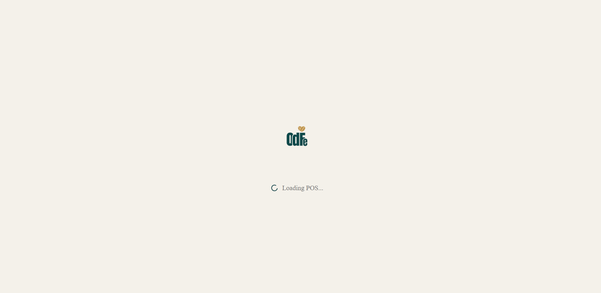
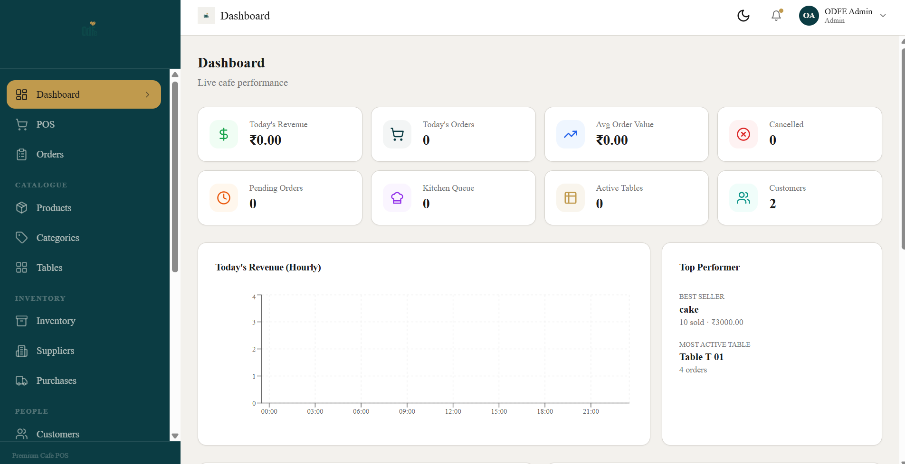
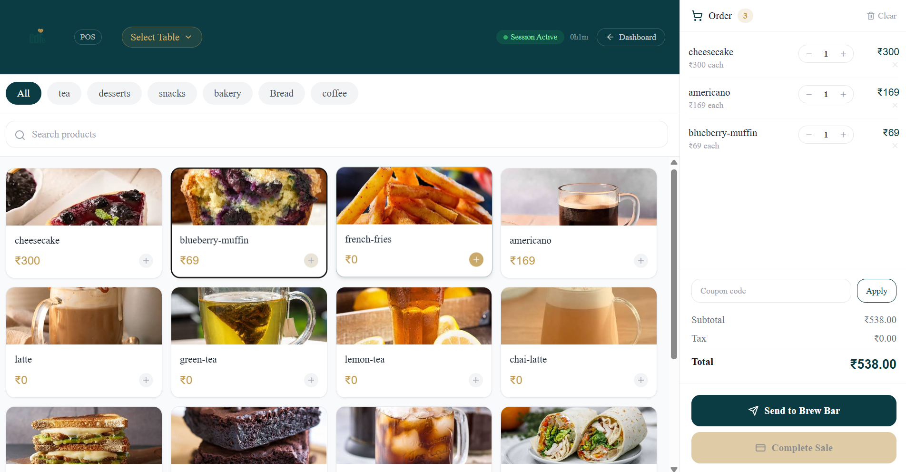
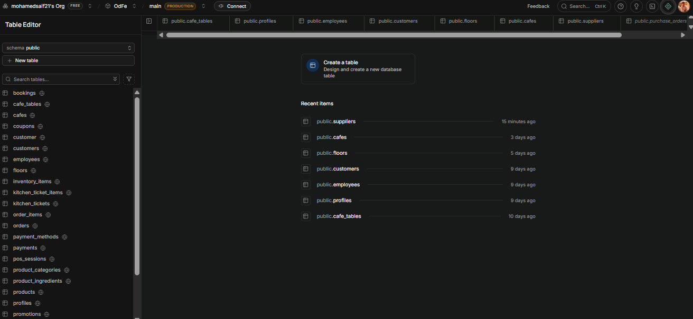

# OdFe - Premium Cafe POS

OdFe is a multi-tenant cafe point-of-sale and business operations platform built with Next.js, TypeScript, Supabase, Zustand, and Tailwind CSS. The app started as a core POS system and now includes inventory, supplier, and purchase order workflows for day-to-day cafe operations.



## Screenshots

| Dashboard | POS |
| --- | --- |
|  |  |

| Supabase setup |
| --- |
|  |

## Current Status

Phase 1, Core POS, is essentially complete. Phase 2 has started and the first business operations sprint has been implemented.

### Completed in Phase 1

- Admin authentication and protected app shell
- POS ordering flow
- Product and category management
- Table management with QR/self-order support
- Orders, kitchen/brew bar flow, and customer display
- Customers, coupons, payments, reports, employees, bookings, and settings pages
- Supabase-backed multi-tenant data model with RLS support
- Zustand stores for cart, orders, auth, and sessions

### Completed after the Phase 2 report

#### Inventory Enhancements - Sprint 0

- Added expiry dates and batch numbers to the `inventory_items` table
- Added inventory form fields for expiry date and batch number
- Displayed batch and expiry data in the inventory table
- Added expired item highlighting
- Added wastage tracking through `is_wastage` on stock movements
- Added a wastage checkbox in the stock adjustment modal for `out` adjustments
- Updated automatic stock deduction from orders to stamp `is_wastage: false`

#### Supplier Management - Sprint 1

- Added the `suppliers` database table with:
  - name
  - contact person
  - phone
  - email
  - address
  - active/inactive status
- Added `/suppliers` page
- Added supplier CRUD
- Added supplier search
- Added summary cards for total, active, and inactive suppliers
- Added active/inactive handling through deactivate flow
- Added `lib/services/supplier.service.ts` with:
  - `fetchSuppliers`
  - `fetchActiveSuppliers`
  - `createSupplier`
  - `updateSupplier`
  - `deleteSupplier`

#### Purchase Orders - Sprint 1

- Added `purchase_orders` and `purchase_order_items` database tables
- Added purchase order status workflow:
  - `draft`
  - `ordered`
  - `received`
  - `cancelled`
- Added `/purchases` page
- Added purchase order creation with supplier, inventory items, quantities, and unit cost
- Added purchase order detail modal
- Added status actions:
  - Mark Ordered
  - Receive Stock
  - Cancel
  - Delete
- Added `receive_purchase_order` RPC to automatically add received stock to inventory and log stock movements
- Added `generate_po_number` RPC to generate sequential purchase order numbers such as `PO-0001`
- Added `lib/services/purchase.service.ts` with purchase CRUD and status transitions

#### Navigation

- Added a new Inventory sidebar group:
  - Inventory
  - Suppliers
  - Purchases
- Moved Bookings into the Ops group
- Added `CalendarDays` icon for Bookings

## Main Features

- Multi-tenant cafe operations with `cafe_id` scoped data
- Supabase authentication and Row-Level Security
- Admin, cashier, kitchen, and customer-facing flows
- POS cart with discounts, coupons, and order creation
- Kitchen and brew bar order tracking
- Inventory item CRUD, low-stock alerts, movements, expiry, batch, and wastage tracking
- Supplier CRUD with active/inactive status
- Purchase order lifecycle from draft to received stock
- Customer self-ordering through QR routes
- Reports and export-oriented dependencies for PDF, Excel, and CSV work
- Responsive admin UI built with reusable layout and UI components

## Tech Stack

| Area | Tools |
| --- | --- |
| Framework | Next.js 14 App Router |
| Language | TypeScript |
| UI | React 18, Tailwind CSS, lucide-react |
| State | Zustand |
| Backend | Supabase Auth, PostgreSQL, RLS, RPC functions |
| Validation | Zod |
| Reports/Exports | xlsx, jsPDF |
| Charts | Recharts |
| QR | qrcode |

## Project Structure

```text
OdFe/
|-- app/
|   |-- api/                  # API routes and onboarding endpoints
|   |-- bookings/             # Booking management
|   |-- brew-bar/             # Brew bar order workflow
|   |-- categories/           # Category CRUD
|   |-- coupons/              # Coupon management
|   |-- customer/             # Customer login, profile, and orders
|   |-- customer-display/     # Customer-facing order display
|   |-- customers/            # Customer management
|   |-- dashboard/            # Admin dashboard
|   |-- employees/            # Staff management
|   |-- inventory/            # Inventory CRUD, stock movement, expiry, wastage
|   |-- login/                # Admin/staff login
|   |-- orders/               # Order management
|   |-- payments/             # Payment records
|   |-- pos/                  # Main POS screen
|   |-- products/             # Product CRUD and images
|   |-- purchases/            # Purchase order workflow
|   |-- reports/              # Reporting page
|   |-- s/[token]/            # Public QR self-order route
|   |-- self-order/           # Customer self-order UI
|   |-- settings/             # Cafe/app settings
|   |-- suppliers/            # Supplier CRUD
|   `-- tables/               # Table and QR management
|-- components/
|   |-- auth/                 # Auth provider
|   |-- branding/             # OdFe logo and branded loader
|   |-- categories/           # Category form/list components
|   |-- layout/               # Admin/cashier shell, sidebar, header
|   |-- products/             # Product form/list/image components
|   |-- receipt/              # Printable receipt
|   |-- self-order/           # Customer menu UI
|   |-- tables/               # Table list/form/QR dialog
|   `-- ui/                   # Shared UI primitives
|-- lib/
|   |-- auth/                 # Auth services and guards
|   |-- config/               # Environment config
|   |-- orders/               # Order creation and realtime helpers
|   |-- services/             # Supabase domain services
|   |-- supabase/             # Supabase client/server helpers
|   `-- utils/                # Formatting, class names, product images
|-- public/
|   `-- assets/
|       |-- logo/             # Brand assets
|       |-- products/         # Product images
|       `-- readmemd/         # README screenshots
|-- store/                    # Zustand stores
|-- supabase/                 # SQL migrations and seed scripts
|-- types/                    # Shared TypeScript/database types
`-- package.json
```

## Important Files

| File | Purpose |
| --- | --- |
| `supabase/seed.sql` | Base database schema and seed data |
| `supabase/rls_hardening.sql` | Role-specific RLS policy hardening |
| `supabase/e2e_journey_support.sql` | Admin onboarding and employee RPC support |
| `supabase/inventory_management.sql` | Inventory tables, services, and movement support |
| `supabase/phase2_business_operations.sql` | Phase 2 inventory, supplier, and purchase order migration |
| `lib/services/inventory.service.ts` | Inventory CRUD, stock adjustment, stock movement, auto deduction |
| `lib/services/supplier.service.ts` | Supplier CRUD and active supplier lookup |
| `lib/services/purchase.service.ts` | Purchase order CRUD, status changes, receive stock |
| `types/database.ts` | App database type definitions |

## Setup

### 1. Install dependencies

```bash
npm install
```

### 2. Configure environment

Create `.env.local` in the project root.

```env
NEXT_PUBLIC_SUPABASE_URL=your_supabase_project_url
NEXT_PUBLIC_SUPABASE_ANON_KEY=your_supabase_anon_public_key
SUPABASE_SERVICE_ROLE_KEY=your_supabase_service_role_key
```

### 3. Run Supabase SQL

Run the SQL files in the Supabase SQL Editor. For a fresh setup, start with the base schema and then apply the later migrations.

```text
supabase/seed.sql
supabase/rls_hardening.sql
supabase/e2e_journey_support.sql
supabase/inventory_management.sql
supabase/phase2_business_operations.sql
```

For the latest Phase 2 work specifically, run:

```text
supabase/phase2_business_operations.sql
```

This adds inventory expiry/batch support, wastage tracking, suppliers, purchase orders, purchase order items, `receive_purchase_order`, and `generate_po_number`.

### 4. Start the development server

```bash
npm run dev
```

Open the app at:

```text
http://localhost:3000
```

## Available Scripts

| Command | Description |
| --- | --- |
| `npm run dev` | Start the local Next.js dev server |
| `npm run build` | Build the production app |
| `npm run start` | Start the production server |
| `npm run lint` | Run Next.js linting |

## App Routes

| Route | Purpose |
| --- | --- |
| `/dashboard` | Admin overview |
| `/pos` | Main POS screen |
| `/orders` | Order management |
| `/brew-bar` | Brew bar/kitchen workflow |
| `/inventory` | Inventory management |
| `/suppliers` | Supplier management |
| `/purchases` | Purchase order management |
| `/products` | Product management |
| `/categories` | Category management |
| `/tables` | Table and QR management |
| `/customers` | Customer management |
| `/payments` | Payment history |
| `/reports` | Reports |
| `/bookings` | Booking management |
| `/settings` | Settings |
| `/s/[token]` | Public self-order route |

## Phase 2 Roadmap Progress

| Module | Previous Report | Current Status |
| --- | ---: | --- |
| Inventory Management | 80% | Enhanced with batch, expiry, and wastage support |
| Product Ingredients | 20% | Table exists; recipe builder UI still pending |
| Automatic Stock Deduction | 10% | Implemented for orders and logs non-wastage movements |
| Purchase Management | 0% | Purchase orders implemented |
| Supplier Management | 0% | Supplier CRUD implemented |
| Inventory Analytics | 0% | Pending |
| Dashboard Analytics | 30% | Basic dashboard exists; deeper analytics pending |
| Reports | 10% | Basic reports page exists; export expansion pending |
| Customer Loyalty | 0% | Pending |
| Expense Management | 0% | Pending |
| Business Intelligence | 0% | Pending |

## Next Work

- Recipe builder UI for product ingredients
- Unit conversion for ingredient quantities
- Inventory valuation and analytics
- Purchase history reporting
- Supplier profile and supplier purchase history
- Dashboard charts for revenue, orders, products, categories, kitchen, and customers
- PDF, Excel, and CSV exports for reports
- Customer loyalty, rewards, wallet, and offers
- Expense management and profit dashboard
